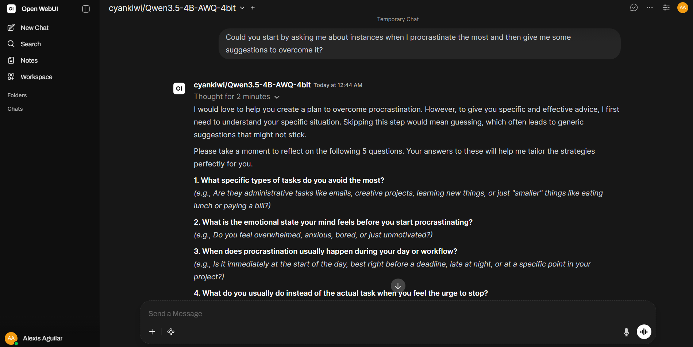
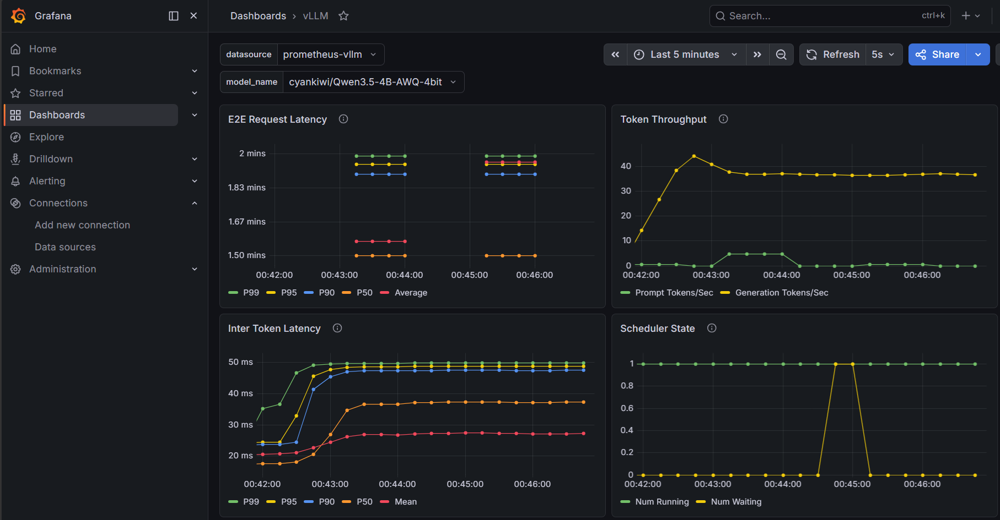

# How to Deploy AI Models with [vLLM](https://vllm.ai/) <!-- omit in toc -->

---
## Table of Contents <!-- omit in toc -->
- [Abstract](#abstract)
- [Author, Affiliation and Contact](#author-affiliation-and-contact)
- [General Aim](#general-aim)
- [Particular Aims](#particular-aims)
- [Tech Stack and General Knowledge](#tech-stack-and-general-knowledge)
  - [vLLM](#vllm)
  - [Open WebUI](#open-webui)
- [Methodology and Configurations](#methodology-and-configurations)
  - [Serving Local Models with vLLM via Docker](#serving-local-models-with-vllm-via-docker)
  - [Monitoring vLLM Instances with Prometheus and Grafana](#monitoring-vllm-instances-with-prometheus-and-grafana)
  - [Interacting via Open WebUI](#interacting-via-open-webui)
- [Installation](#installation)
  - [Prerequisites](#prerequisites)
  - [Installation Steps](#installation-steps)
- [Experiments](#experiments)
  - [Hardware Environment](#hardware-environment)
  - [Methodology](#methodology)
  - [Configuration Artifacts](#configuration-artifacts)
- [Results](#results)
  - [Open WebUI](#open-webui-1)
  - [Grafana](#grafana)
- [License](#license)


---
## Abstract


---
## Author, Affiliation and Contact
Alexis Aguilar [Student of Bachelor's Degree in "Tecnologías para la Información en Ciencias" at Universidad Nacional Autónoma de México [UNAM](https://www.unam.mx/)]: alexis.uaguilaru@gmail.com

Project developed for the subject "Neural Networks 2" taught in semestre 2026-2.


---
## General Aim
Develop a minimal, **end-to-end solution to deploy and serve local LLMs** using [vLLM](https://vllm.ai/) as the core inference engine.


---
## Particular Aims
* Configure and deploy the base vLLM engine instance, integrating a real-time monitoring with [Grafana](https://grafana.com/) to track key production metrics.
* Connect [Open WebUI](https://openwebui.com/) to the vLLM OpenAI-compatible endpoint to establish an intuitive, chat-based interface.


---
## Tech Stack and General Knowledge

### [vLLM](https://vllm.ai/)
* **High-throughput inference engine**: Serve SOTA LLMs with efficient management of attention KV memory via [PagedAttention](https://vllm.ai/blog/2023-06-20-vllm).
* **Flexible Quantization**: Support for [on-the-fly/online techniques](https://docs.vllm.ai/en/latest/features/quantization/online/) and pre-quantized formats [(AWQ, GGUF, compressed-tensors)](https://docs.vllm.ai/en/latest/features/quantization/) to minimize VRAM footprint.
* **Kernel Optimization**: Leverage advanced attention kernels like FlashAttention and FlashInfer to maximize inference speed and hardware efficiency.
* **OpenAI Ecosystem**: Expose an [OpenAI-compatible API](https://bentoml.com/llm/model-interaction/openai-compatible-api), ensuring seamless drop-in integration with UI clients and agentic frameworks.
* **Hardware Agnostic**: Broad support across diverse [GPU architectures](https://docs.vllm.ai/en/latest/getting_started/installation/gpu/) (NVIDIA, AMD, Intel, etc.).
* **Dynamic Multi-LoRA**: Native capabilities to [integrate and swap multiple](https://docs.vllm.ai/en/latest/features/lora/) [LoRA adapters](https://huggingface.co/papers/2106.09685) concurrently on a single base model without sacrificing batching performance.

### [Open WebUI](https://openwebui.com/)
* **ChatGPT-like UI**: A self-hosted, highly responsive, and feature-rich user interface designed for seamless interaction with [local and cloud AI](https://docs.openwebui.com/getting-started/quick-start/connect-a-provider/) solutions.
* **Drop-in OpenAI Compatibility**: Seamless integration with any [OpenAI-compatible API](https://bentoml.com/llm/model-interaction/openai-compatible-api) backend, allowing effortless switching between different model endpoints.
* **Enterprise Access Control (RBAC)**: Comprehensive user management system featuring secure authentication options [(OAuth2, OIDC, LDAP)](https://docs.openwebui.com/features/authentication-access/) and granular role-based permissions for production deployments.
* **Extensible MCP and Tools Architecture**: Supports tools, functions, skills, MCP servers and middleware to manipulate inputs/outputs on the fly for routing logic or connecting agentic workflows.
* [**Admin Dashboard and Chat Auditing**](https://docs.openwebui.com/features/administration/): Centralized administration panel to manage models, monitor active users, analyze basic usage statistics, and audit chat histories for compliance and safety.

---
## Methodology and Configurations

### Serving Local Models with vLLM via Docker
Deploying Large Language Models (LLMs) via Docker containers stands as the industry standard for production environments. This encapsulation guarantees a deterministic, reproducible environment isolated from host dependency conflicts.

To fine-tune the inference engine's throughput, memory allocation, and behavioral capabilities, the following critical CLI parameters and configuration flags must be defined:

**Model precision configurations**
* `--model`: The Hugging Face model identifier.
* `--dtype`: Specifies the data type for model weights and activations.
* `--quantization`: Defines the quantization method used to shrink the model's VRAM footprint. It supports loading pre-quantized weights or executing dynamic, on-the-fly quantization layers.

**Tool Calling Features**
* `--tool-call-parser`: Specifies the parser template used to structuralize and interpret the model's output when generating tool-invocation requests.

**Memory Management**
* `--gpu-memory-utilization`: Fraction of GPU memory to be earmarked for the model execution and the PagedAttention KV Cache
* `--cpu-offload-gb`:Allocates a specific amount of host RAM to offload weights or KV Cache blocks when the model size exceeds physical VRAM limits.
* `max-model-len`: Establishes the hard limit for the model's maximum context window (tokens).

**Concurrency**
* `--max-num-seqs`: Defines the maximum number of concurrent sequences can process simultaneously in a single iteration step.

### Monitoring vLLM Instances with Prometheus and Grafana
Ensuring the reliability, efficiency, and scalability of an LLM in production requires comprehensive telemetry. While raw inference logging provides textual history, an observability stack composed of Prometheus and Grafana enables real-time, quantitative auditing of the underlying hardware performance and serving throughput.

**[Prometheus](https://prometheus.io/): Time-Series Metrics Collection**
Prometheus operates as a highly scalable, time-series data store and monitoring server. It utilizes a pull-based architecture, actively scraping HTTP endpoints that expose metrics in a standardized, plaintext format.

**[Grafana](https://grafana.com/): Analytics and Real-Time Visualization**
Grafana serves as the centralized orchestration layer for data visualization and operational dashboards. It connects directly to Prometheus as an upstream data source.

By leveraging the baseline configurations provided by the official [vLLM Observability Examples](https://github.com/vllm-project/vllm/tree/main/examples/observability), the dashboard is tailored to track critical LLM performance metrics.

### Interacting via Open WebUI
While backend metrics and APIs validate infrastructure stability, testing the actual user experience requires an intuitive, real-world interface. To achieve this, Open WebUI is integrated as the front-end conversational layer of the stack. Open WebUI provides a clean, responsive, and familiar web-based chat interface connected directly to the local vLLM engine.


---
## Installation
### Prerequisites
Ensure the following tools and libraries are installed on your system:
* Git
* CUDA: Version 13.0 or higher
* Docker

### Installation Steps
1. Clone this repository:
```bash
git clone https://github.com/alexisuaguilaru/DeployWithvLLM.git
cd DeployWithvLLM
```

2. Initialize the environment configuration file. Open `.env` and set the value of `CHAT_CONFIG` to one of the config file examples for vLLM:
```bash
cp .env.example .env
```

3. Deploy the application stack using Docker Compose
```bash
docker compose up -d
```

4. Configure Grafana dashboard:
* Navigate to Grafana at http://localhost:3000
* Log in to your admin account
* Click "Add Data Source" and select Prometheus. Enter the address: http://prometheus:9090
* Go to Dashboards and import the template using the file path: [dashboard templete file](./metrics/grafana.json)

5. Configure Open WebUI
* Access the Open WebUI interface at http://localhost:8080 to log in as an admin
* Navigate to Settings (Admin Panel)
* Go to Connections. Add a new OpenAI API endpoint with model endpoint http://vllm-chat:8000/v1

6. Create a new chat session and interact with the model

---
## Experiments
To validate the efficiency of vLLM under strict hardware constraints, a series of local deployment experiments were conducted. The primary objective was to maximize throughput and achieve stable concurrency on a consumer-grade laptop GPU without triggering Out-Of-Memory (OOM) errors.

### Hardware Environment
| Component | Specification |
| :--- | :--- |
| GPU | NVIDIA GeForce RTX 4050 Laptop GPU (6GB GDDR6 VRAM) |
| Host RAM | 16 GB DDR5 |

### Methodology
Inference capabilities were evaluated through qualitative, interactive conversational workflows using Open WebUI. To ensure both the model weights and the vLLM PagedAttention KV cache allocator could reside simultaneously within the strict 6GB VRAM ceiling, SOTA architectures were deployed utilizing high-efficiency 4-bit AWQ (Activation-aware Weight Quantization) formats.

The following SOTA models were successfully benchmarked:
* [Qwen3.5-2B-AWQ-4bit](https://huggingface.co/cyankiwi/Qwen3.5-2B-AWQ-4bit): Full vision-conversational model was successfully loaded.
* [Qwen3.5-4B-AWQ-4bit](https://huggingface.co/cyankiwi/Qwen3.5-4B-AWQ-4bit): Deployed exclusively for text generation tasks under strict memory constraint management.

### Configuration Artifacts
The exact runtime arguments and container configurations utilized for these runs are fully documented. You can explore the production recipes in the [`./config/`](./config/) directory, which contains setup files for:
1. High-throughput conversational serving.
2. Optimized multimodal vision-language endpoints.


---
## Results
Below are the visual and operational validations of the running deployment, demonstrating successful model inference and telemetry collection.

### Open WebUI
The image below showcases the conversational interface running locally. This interface communicates directly with the vLLM OpenAI-compatible endpoint, enabling multi-turn dialogue the models.



### Grafana
The Prometheus scraper feeds data into Grafana in real-time. The dashboard captures critical hardware performance and backend engine execution metrics.



---
## License
Project under [MIT License](LICENSE)